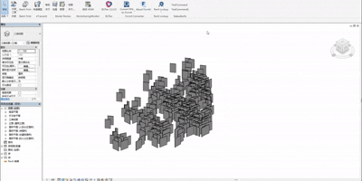

```markdown
# 📦 Repository Information

**NuGet:** [https://www.nuget.org/packages/Su.Revit.UI.StatusBarEx](https://www.nuget.org/packages/Su.Revit.UI.StatusBarEx)

**Gitee:** [https://gitee.com/SususuChang/status-bar-ex](https://gitee.com/SususuChang/status-bar-ex)

**GitHub:** [https://github.com/SususuChang/status-bar-ex](https://github.com/SususuChang/status-bar-ex)

---

# 🚀 The Best Revit Progress Bar Component!

 

---

## 🧩 Project Introduction

This project is **a progress bar component specifically designed for Revit secondary development**,
extended based on the original open-source project [ricaun.Revit.UI.StatusBar](https://github.com/ricaun-io/ricaun.Revit.UI.StatusBar).

Since the original author didn't plan to support **Revit 2018 and earlier versions**, and didn't support modifying progress bar styles or default text,
to adapt to **the current state of Revit secondary development in China (still commonly using versions below 2020, with requirements for Chinese UI)**,
this project was born 🚀

---

## ✨ New Features

| Feature | Description |
| :--- | :--- |
| ✅ **Support for Older Revit Versions** | Added support for **Revit 2011 - Revit 2026** full series |
| 🎯 **UI Optimization** | Progress bar position adjusted to **below the Ribbon**, more integrated with Revit operation experience |
| 🧰 **Customizable Styles** | Supports passing `Options` parameters to customize progress bar styles such as: colors, text, dimensions, etc. (currently only supports cancel button Content) |

---

## 🧱 Version Support

| Revit Version | Support Status |
| :--- | :---: |
| 2011 | ✅ |
| 2012 | ✅ |
| 2013 | ✅ |
| 2014 | ✅ |
| 2015 | ✅ |
| 2016 | ✅ |
| 2017 | ✅ |
| 2018 | ✅ |
| 2019 | ✅ |
| 2020 | ✅ |
| 2021 | ✅ |
| 2022 | ✅ |
| 2023 | ✅ |
| 2024 | ✅ |
| 2025 | ✅ |
| 2026 | ✅ |

---

## 🧩 Installation Methods

### Method 1: Package Manager Console

```powershell
# Choose the appropriate package according to your Revit version
Install-Package Su.Revit.UI.StatusBarEx.2018 -Version 1.0.0
Install-Package Su.Revit.UI.StatusBarEx.2019 -Version 1.0.0
Install-Package Su.Revit.UI.StatusBarEx.2020 -Version 1.0.0
```

### Method 2: .NET CLI

```bash
dotnet add package Su.Revit.UI.StatusBarEx.2018 --version 1.0.0
dotnet add package Su.Revit.UI.StatusBarEx.2019 --version 1.0.0
dotnet add package Su.Revit.UI.StatusBarEx.2020 --version 1.0.0
```

### Method 3: Visual Studio NuGet Package Manager

```
1. Right-click project → Manage NuGet Packages
2. Search for: Su.Revit.UI.StatusBarEx in Browse tab
3. Install the package suitable for your Revit version
```

---

## 🪄 Usage Methods

### 1️⃣ Basic Usage - Iterating Collection Elements

```csharp
// Example: Batch processing wall elements
var walls = new FilteredElementCollector(doc)
    .OfCategory(BuiltInCategory.OST_Walls)
    .WhereElementIsNotElementType()
    .Cast<Wall>();

ProgressBarExUtils.Run(
    elements: walls,
    loopAction: wall =>
    {
        wall.get_Parameter(BuiltInParameter.ALL_MODEL_INSTANCE_COMMENTS)
           ?.Set("Processed");
    }
);
```

---

### 2️⃣ Using Integer Count Loop

```csharp
int count = 50;
ProgressBarExUtils.Run(
    count: count,
    loopAction: i =>
    {
        // i from 0 to count-1
        Task.Delay(50).Wait(); // Simulate time-consuming operation
    }
);
```

---

### 3️⃣ Cancelable Loop within Transaction

```csharp
var walls = new FilteredElementCollector(doc)
    .OfCategory(BuiltInCategory.OST_Walls)
    .WhereElementIsNotElementType()
    .Cast<Wall>();

using (var tx = new Transaction(doc, "Batch Modification"))
{
    tx.Start();
    ProgressBarExUtils.RunCancelable(
        transaction: tx,
        sources: walls,
        loopAction: wall =>
        {
            Thread.Sleep(100);
            wall.get_Parameter(BuiltInParameter.ALL_MODEL_INSTANCE_COMMENTS)
                ?.Set("Batch Processing Completed");
        }
    );
    if (tx.GetStatus() == TransactionStatus.Started)
    {
        tx.Commit();
    }
}
```

---

### 4️⃣ Cancelable Loop within TransactionGroup

```csharp
var walls = new FilteredElementCollector(doc)
    .OfCategory(BuiltInCategory.OST_Walls)
    .WhereElementIsNotElementType()
    .Cast<Wall>();

using (var tg = new TransactionGroup(doc, "Transaction Group Batch Processing"))
{
    tg.Start();
    ProgressBarExUtils.RunCancelable(
        transactionGroup: tg,
        sources: walls,
        loopAction: wall =>
    {
        wall.get_Parameter(BuiltInParameter.ALL_MODEL_INSTANCE_COMMENTS)
            ?.Set("Transaction Group Processing Completed");
    }
    );
    tg.Assimilate(); // Merge transaction group
}
```
