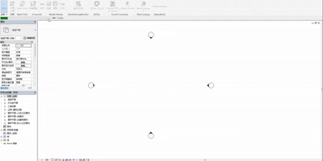

# 最好用的Revit进度条封装！
 
## 项目介绍

专为Revit二次开发设计的进度条封装组件，基于 [ricaun.Revit.UI.StatusBar](https://github.com/ricaun-io/ricaun.Revit.UI.StatusBar) 进行拓展开发

由于原作者没有支持Revit 2018及以下版本的计划,且不支持修改进度条样式和默认文本内容的等。为了适应国内Revit二次开发现状（绝大多数公司都在使用2020及以下版本，且界面要求全中文等)故本项目应运而生

### 版本支持
- ✅ Revit 2011
- ✅ Revit 2012
- ✅ Revit 2013
- ✅ Revit 2014
- ✅ Revit 2015
- ✅ Revit 2016
- ✅ Revit 2017  
- ✅ Revit 2018
- ✅ Revit 2019
- ✅ Revit 2020
- ✅ Revit 2021
- ✅ Revit 2022
- ✅ Revit 2023
- ✅ Revit 2024
- ✅ Revit 2025
- ✅ Revit 2026

## 使用方法

### 1. 基础用法 - 迭代集合

```csharp
// 示例：批量处理墙元素
var walls = new FilteredElementCollector(doc)
    .OfCategory(BuiltInCategory.OST_Walls)
    .WhereElementIsNotElementType()
    .Cast<Wall>();

ProgressBarExUtils.Run(
    elements: walls,
    loopAction: wall =>
    {
        // 对每个墙执行的操作
        wall.get_Parameter(BuiltInParameter.ALL_MODEL_INSTANCE_COMMENTS)
           ?.Set("已处理");
    },
    title: "处理墙元素"
);

```

### 2. 使用整数计数循环
```csharp
int count = 50;
ProgressBarExUtils.Run(
    count: count,
    loopAction: i =>
    {
        // i 从 0 到 count-1
        Task.Delay(50).Wait(); // 模拟耗时操作
    },
    title: "整数循环演示"
);
);

```
### 3.可取消的事务内循环（Transaction）
```csharp

var walls = new FilteredElementCollector(doc)
    .OfCategory(BuiltInCategory.OST_Walls)
    .WhereElementIsNotElementType()
    .Cast<Wall>();

using (var tx = new Transaction(doc, "批量修改"))
{
    tx.Start();
    ProgressBarExUtils.RunCancelable(
        transaction: tx,
        sources: walls,
        loopAction: wall =>
        {
            wall.get_Parameter(BuiltInParameter.ALL_MODEL_INSTANCE_COMMENTS)
               ?.Set("批量处理完成");
        },
        title: "可取消事务操作"
    );

    if (tx.GetStatus() == TransactionStatus.Started)
    {
        tx.Commit();
    }
}

```

### 4. 可取消的事务组内循环（TransactionGroup）
```csharp

var walls = new FilteredElementCollector(doc)
    .OfCategory(BuiltInCategory.OST_Walls)
    .WhereElementIsNotElementType()
    .Cast<Wall>();

using (var tg = new TransactionGroup(doc, "事务组批量处理"))
{
    tg.Start();
    ProgressBarExUtils.RunCancelable(
        transactionGroup: tg,
        sources: walls,
        loopAction: wall =>
        {
          wall.get_Parameter(BuiltInParameter.ALL_MODEL_INSTANCE_COMMENTS)
                   ?.Set("事务组处理完成");
        },
        title: "事务组可取消处理"
    );
    tg.Assimilate(); // 合并事务组
}

```