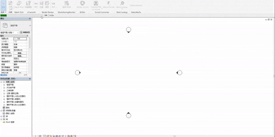
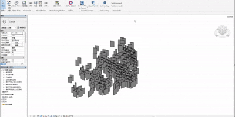

 [English](README.en.md) | [简体中文](README.md)
 


# 📦 仓库信息

**NuGet:** [https://www.nuget.org/packages/Su.Revit.UI.StatusBarEx](https://www.nuget.org/packages/Su.Revit.UI.StatusBarEx)

**Gitee:** [https://gitee.com/SususuChang/status-bar-ex](https://gitee.com/SususuChang/status-bar-ex)

**GitHub:** [https://github.com/ViewSuSu/Su.Revit.UI.StatusBarEx](https://github.com/ViewSuSu/Su.Revit.UI.StatusBarEx)

---

# 🚀 最好用的 Revit 进度条封装组件！

 

---

## 🧩 项目介绍

本项目是 **专为 Revit 二次开发设计的进度条封装组件**，
基于原开源项目 [ricaun.Revit.UI.StatusBar](https://github.com/ricaun-io/ricaun.Revit.UI.StatusBar) 进行拓展开发。

由于原作者未计划支持 **Revit 2018 及以下版本**，且不支持修改进度条样式或默认文本，
为适应 **国内 Revit 二开现状（仍普遍使用 2020 以下版本，且要求中文 UI）**，
本项目应运而生 🚀

---

## ✨ 功能新增

| 功能项 | 描述 |
| :--- | :--- |
| ✅ **支持旧版本 Revit** | 新增支持 **Revit 2011 - Revit 2026** 全系列版本 |
| 🎯 **界面优化** | 进度条位置调整至 **Ribbon 下方**，更贴合 Revit 操作体验 |
| 🧰 **可定制样式** | 支持传入 `Options` 参数来自定义进度条样式比如：颜色、文本、尺寸等（目前仅支持取消按钮 Button 的 Content） |
| 🔄 **取消操作支持** | 支持在长时间操作中取消执行，提升用户体验 |

---

## 🧩 安装方法

### 方法一：Package Manager 控制台

```powershell
# 根据你的 Revit 版本选择对应的包
Install-Package Su.Revit.UI.StatusBarEx.2018 -Version 1.0.0
Install-Package Su.Revit.UI.StatusBarEx.2019 -Version 1.0.0
Install-Package Su.Revit.UI.StatusBarEx.2020 -Version 1.0.0
# 更多版本请查看 NuGet 页面
```

### 方法二：.NET CLI

```bash
dotnet add package Su.Revit.UI.StatusBarEx.2018 --version 1.0.0
dotnet add package Su.Revit.UI.StatusBarEx.2019 --version 1.0.0
dotnet add package Su.Revit.UI.StatusBarEx.2020 --version 1.0.0
```

### 方法三：Visual Studio NuGet 包管理器

```
1. 右键点击项目 → 管理 NuGet 程序包
2. 在浏览选项卡中搜索：Su.Revit.UI.StatusBarEx
3. 选择适合你 Revit 版本的包进行安装
```

---

## 🪄 使用方法

### 1️⃣ 基础用法 —— 遍历集合元素

```csharp
// 示例：批量处理墙元素
var walls = new FilteredElementCollector(doc)
    .OfCategory(BuiltInCategory.OST_Walls)
    .WhereElementIsNotElementType()
    .Cast<Wall>();

ProgressBarExUtils.Run(
    elements: walls,
    loopAction: wall =>
    {
        wall.get_Parameter(BuiltInParameter.ALL_MODEL_INSTANCE_COMMENTS)
           ?.Set("已处理");
    }
);
```

---

### 2️⃣ 使用整数计数循环

```csharp
int count = 50;
ProgressBarExUtils.Run(
    count: count,
    loopAction: i =>
    {
        // i 从 0 到 count-1
        Task.Delay(50).Wait(); // 模拟耗时操作
    }
);
```

---

### 3️⃣ 可取消的事务内循环（Transaction）

```csharp
var walls = new FilteredElementCollector(doc)
    .OfCategory(BuiltInCategory.OST_Walls)
    .WhereElementIsNotElementType()
    .Cast<Wall>();

using (var tx = new Transaction(doc, "批量修改"))
{
    tx.Start();
    ProgressBarExUtils.RunCancelable(
        transaction: tx,
        sources: walls,
        loopAction: wall =>
        {
            Thread.Sleep(100);
            wall.get_Parameter(BuiltInParameter.ALL_MODEL_INSTANCE_COMMENTS)
                ?.Set("批量处理完成");
        }
    );
    if (tx.GetStatus() == TransactionStatus.Started)
    {
        tx.Commit();
    }
}
```

---

### 4️⃣ 可取消的事务组内循环（TransactionGroup）

```csharp
var walls = new FilteredElementCollector(doc)
    .OfCategory(BuiltInCategory.OST_Walls)
    .WhereElementIsNotElementType()
    .Cast<Wall>();

using (var tg = new TransactionGroup(doc, "事务组批量处理"))
{
    tg.Start();
    ProgressBarExUtils.RunCancelable(
        transactionGroup: tg,
        sources: walls,
        loopAction: wall =>
    {
        wall.get_Parameter(BuiltInParameter.ALL_MODEL_INSTANCE_COMMENTS)
            ?.Set("事务组处理完成");
    }
    );
    tg.Assimilate(); // 合并事务组
}
```

---

### 5️⃣ 自定义选项用法

```csharp
var options = new ProgressBarOptions
{
    CancelButtonContent = "取消操作",
    // 更多自定义选项...
};

ProgressBarExUtils.Run(
    elements: walls,
    options: options,
    loopAction: wall =>
    {
        // 处理逻辑
    }
);
```
## 🤝 贡献指南

我们欢迎并感谢所有形式的贡献！

### 开发环境要求
- Visual Studio 2022 或更高版本

---

## 📄 许可证

本项目采用 MIT 许可证 - 查看 [LICENSE](LICENSE) 文件了解详情。

## 🙏 致谢

感谢以下开源项目：
- [ricaun.Revit.UI.StatusBar](https://github.com/ricaun-io/ricaun.Revit.UI.StatusBar) - 原始项目基础
- 所有贡献者和用户的支持

---

**如果这个项目对您有帮助，请给个 ⭐ Star 支持一下！**


## 星曲线图 / Star History

[](https://star-history.com/#ViewSuSu/Su.Revit.UI.StatusBarEx&Date)
